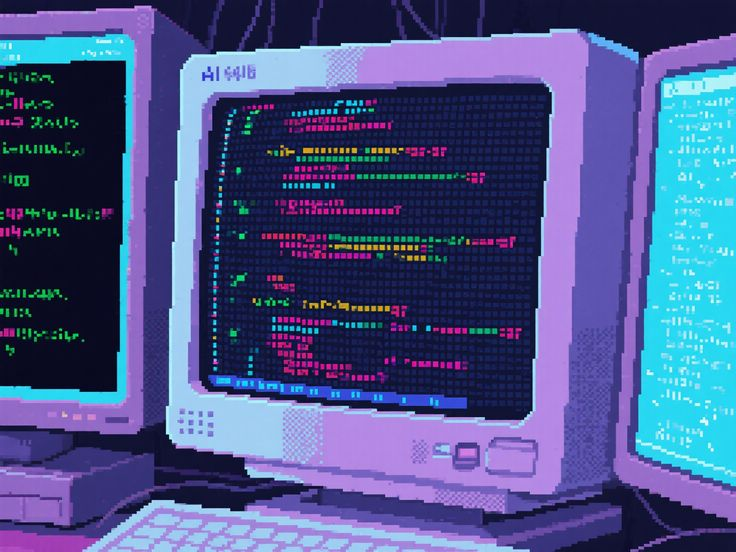

<h1> Felipe Catarino de Souza</h1>

----------

|  <h2>👋**About Me**</h2>   |   | 
|----------|--|
|As an Information Technology enthusiast, I have focused my self-directed learning on systems development, specifically the creation of servers, web pages, and applications. I also have a strong interest in operating systems—particularly Linux—having gained practical experience with Linux Mint and developed skills in configuration, performance optimization, and system administration. I now aim to apply and expand this knowledge through formal technical or higher education in the IT field.   <h2>🔗 **Links:**</h2>     |  |

----

### 👾 My GitHub Contribution Pacman
<picture>
  
</picture>

---

## 🌐 Technologies

  <table>
    <tr>
      <td align="center"><b>Frontend</b> </td>
      <td align="center"><b>Backend</b> </td>
    </tr>
    <tr>
      <td align="center"><b>Lenguages</b> </td>
      <td align="center"><b>DevOps and Tools</b> </td>
    </tr>
  </table>

-----

-----

<h2>📞 Contact:</h2>

Phone: (15) 99723-8091

E-mail: felipe.catarino.dev@gmail.com

-------
⭐️ Always seeking growth and new challenges!

